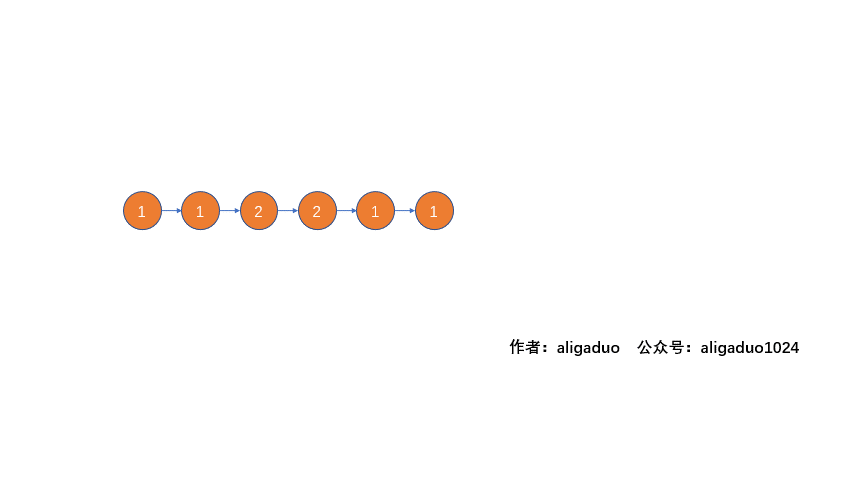
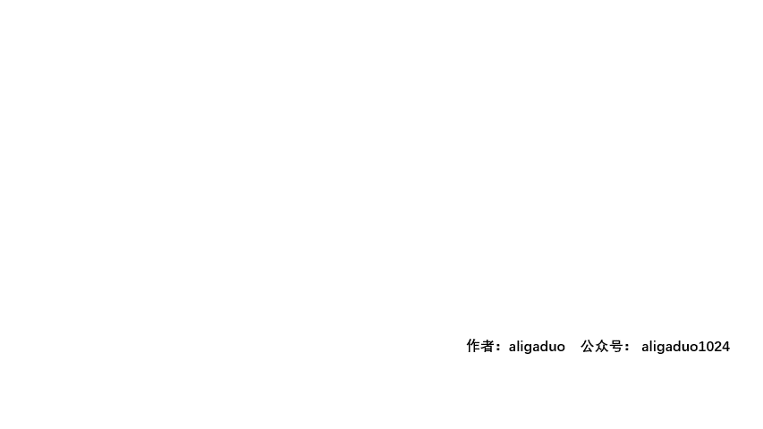
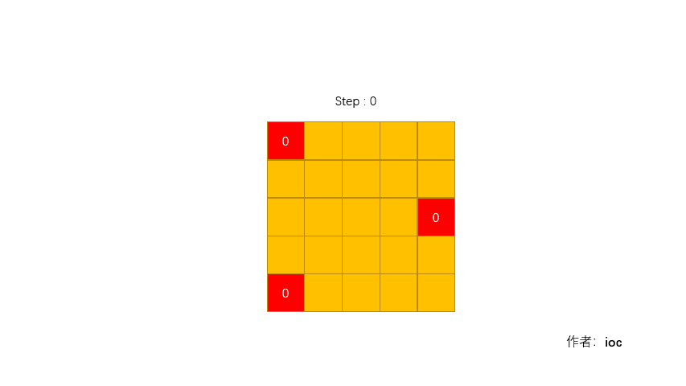

# leetcode
### 记录在leetcode上的学习，并不只是刷题，更重要的是将不同的题型进行分类，使用多种算法解决问题
    使得代码达到精简的程度，写出有效率的代码是要不断需要学习的事。
### Talk is cheap.Show me the code.

|  题号   | GIF演示  |
|  ----  | ----    |
|  11-盛水最多的容器    |     |
|  42-接雨水 |     |
|  58-最后一个单词的长度 |    |  
|  118-杨辉三角 |     |  
|  234-回文链表 |     |  
|  445-两数之和II |     |  
|  942-增减字符串匹配 |     |
|  994-腐烂的橘子 |     |
|  1054-距离相等的条形码 |     |
|  1137-第n个斐波那契数 |     |
|   |     |
|   |     |
|   |     |
|   |     |
|   |     |
|   |     |
|   |     |
|   |     |
|   |     |
